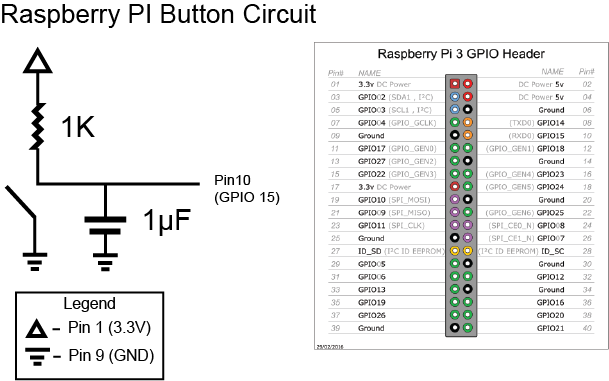

# Miniature World Sawmill Exhibit

## About

This repo is a collection of files for configuration and installation of the [PiMediaSync](https://github.com/limbicmedia/PiMediaSync) application to run the Sawmill exhibit at [Miniature World](https://miniatureworld.com/) in Victoria, BC, Canada.

## Installation

To install this application on a Raspberry Pi, first download a Legacy 32-bit version of the Raspberry Pi OS based on the Buster Debian release, such as the [2023-05-03 release](https://downloads.raspberrypi.com/raspios_oldstable_armhf/images/raspios_oldstable_armhf-2023-05-03/).

Load the OS image onto a card using the [Raspberry Pi Imager](https://www.raspberrypi.com/software/). When loading the image, be sure to select the correct model of Raspberry Pi in the Raspberry Pi Imager interface. Additionally, set the following configuration options.
- Set the network SSID and password to allow the Pi to connect to a wireless network when it boots.
- Enable SSH with password authentication.
- Set the hostname of the device. You will need to know the hostname to find its IP address.
- Set a new default username and password. You will need the username and password to log in via SSH.

## Setup

Once the Raspberry Pi OS is installed on a card, insert it into the Pi and power it on. Use `nmap` or other networking tools to find the Pi's IP address (which may require knowing its hostname) and connect to it using SSH. Then run the following commands in the terminal to install the application.

```bash
sudo raspi-config
```

This will open a menu. Use the menu to enable autologin for the new default user, and then to expand the filesystem. Then reboot the device and reopen the terminal, and run the following additional commands.

```bash
sudo su
export SAWMILL_VERSION=v2.1.3  # the version you wish to install
export GITHUB_HOST=limbicmedia # the github account hosting the project's current code
wget -O - https://raw.githubusercontent.com/${GITHUB_HOST}/mini-world-sawmill-display/${SAWMILL_VERSION}/setup.sh | bash
```

### Installation Details

The above installation command will:
- download and install `video/sawmill.mov` and `sawmill_config.py`,
- download and install `PiMediaSync` (based on the version found in `PIMEDIASYNC_VERSION`), and
- enable `PiMediaSync` at boot (using `systemd`).

By default:
- `PiMediaSync` is installed in `/opt/pimediasync`, and
- Sawmill files are installed in `/opt/sawmill`.

## Files

This repo contains 4 main files:

#### [setup.sh](./setup.sh)

This file is responsible for installing the entire project (including `PiMediaSync`) and configuring it to run at boot.

#### [PIMEDIASYNC_VERSION](./PIMEDIASYNC_VERSION)

This file sets the version of `PiMediaSync` which will be installed.

#### [sawmill_config.py](./sawmill_config.py)

This file is responsible for setting all of the necessary config variables in the `PiMediaSync` application. The core functionality of the exhibit is encoded in this file.

#### [sawmill.mov](./video/sawmill.mov)

This is the video file played for this exhibit.

## Interaction

The exhibit is activated by a button on the front of the display.

The code checks for a falling edge on `GPIO15` (pin 10 of RPI) to activate the display.

### Button Wiring

The diagram below shows the circuit wiring for the button.

A 1K resistor acts as a pull up. The small resistance is to accommodate the long wire leads running to the button. The 1µF capacitor helps reduce noise in the system.



### System Diagram

Below is an image showing the physical setup of the system.


## Previous Versions

Initial version of `mini-world-sawmill-display` contained all of the code necessary to run the exhibit. Since v2.0.0, the operational code has been broken out into [PiMediaSync](https://github.com/limbicmedia/PiMediaSync). This allows for more projects to be made with the core code and the configuration and support files (i.e. audio, video, etc) stored in their own space.
